# Multi-Lingual-FIR-Summarization-System-With-Case-Database-Using-Streamlit-UI
FIR Sahayak: Fast, accurate AI e-Police Desk. Upload FIR → OCR, summarization, 12-language translation. Natural language search by date, FIR#, name, complainant/accused. Local DB with advanced filters. Streamlit UI, Python/FastAPI, Tesseract OCR, Qwen model. Fully offline, zero external APIs. Secure case management for law enforcement.

FIR Sahayak is an AI-powered e-Police Desk for FIR intake, OCR, summarization & multilingual translation. Upload any FIR document → AI extracts text, generates structured summary, translates into 12 Indian languages. The smart assistant enables natural language search across cases by date, FIR number, complainant name, accused name, or free-text queries like "show FIRs between 1 Jan 2025 and 15 June 2025". All records are stored locally in SQLite database with advanced filtering. Streamlit web interface with dark police-style theme ensures intuitive case management. Built with Python, FastAPI, Tesseract OCR, Qwen summarization model & NLP date parser. Secure, offline-ready, zero third-party API dependency.


# 🛡️ FIR Sahayak — AI-Powered e‑Police Summarization Desk

> **FIR Sahayak** is an intelligent, offline‑ready system that transforms First Information Report (FIR) management. It combines **OCR, AI summarization, multilingual translation, and natural language search** into a single, intuitive platform for law enforcement.

---

## ✨ Key Features

| Feature | Description |
|---------|-------------|
| **📄 FIR Upload & OCR** | Upload any FIR document (PDF, PNG, JPG) and automatically extract text using Tesseract OCR. |
| **🧠 AI Summarization** | Generate concise, structured summaries from raw FIR text using a fine‑tuned **Qwen 1.5B‑Instruct** model. |
| **🌐 12‑Language Translation** | Translate summaries instantly into **Bengali, Hindi, Telugu, Tamil, Odia, Marathi, Gujarati, Kannada, Malayalam, Punjabi, Urdu, and Sanskrit**. |
| **🔎 Natural Language Search** | Query the case database conversationally: *“show FIRs between 1 Jan 2025 and 15 June 2025”* or *“search complainant Amit”*. |
| **📋 Advanced Filtering** | Filter records by FIR number, complainant/accused name, date range, and more. |
| **🗄️ Local SQLite Database** | All case data is stored securely in a local SQLite database – no cloud dependency. |
| **💻 Streamlit UI** | A polished, police‑themed desktop interface for rapid case management. |
| **🔒 Offline‑First** | Fully functional without an internet connection – ideal for secure environments. |

---

## 🚀 Technology Stack

| Component | Technology |
|-----------|------------|
| **Backend API** | FastAPI (Python) |
| **Frontend UI** | Streamlit (Python) |
| **OCR Engine** | Tesseract OCR |
| **Summarization** | Qwen2.5‑1.5B‑Instruct (fine‑tuned) |
| **Translation** | googletrans + deep_translator (offline fallback) |
| **Database** | SQLite3 |
| **Date Parsing** | dateparser + custom NLP logic |
| **Deployment** | Docker‑ready |

---

## 📸 Pipeline & Features (Visual Walkthrough)

### 1. FIR Upload → OCR → Summarization → Translation
> The core pipeline extracts text, generates a summary, and translates it into 12 Indian languages.

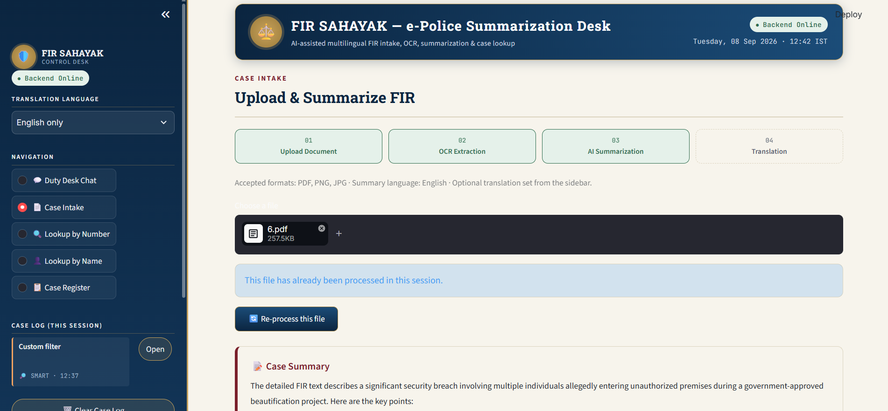  
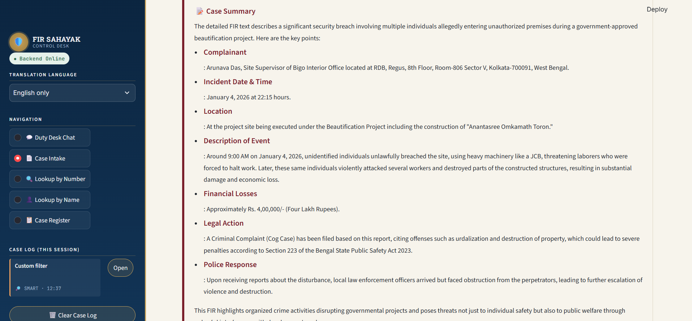  
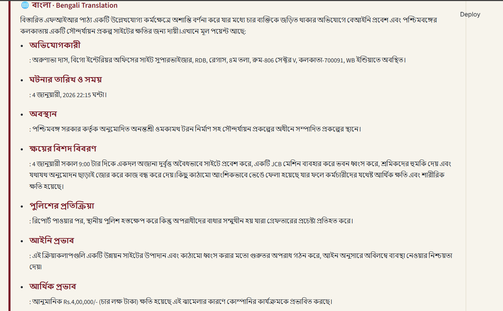  
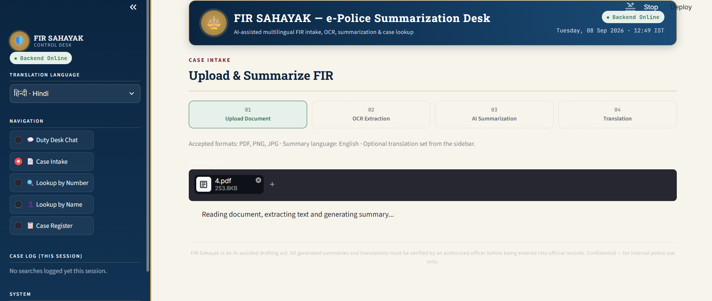  
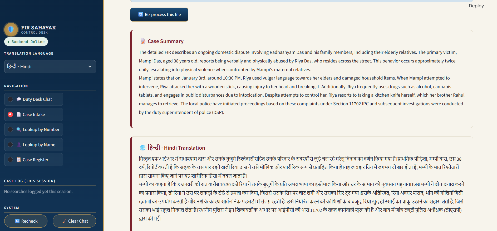

**Supported translation languages:**  
Bengali (বাংলা), Hindi (हिन्दी), Telugu (తెలుగు), Tamil (தமிழ்), Odia (ଓଡ଼ିଆ), Marathi (मराठी), Gujarati (ગુજરાતી), Kannada (ಕನ್ನಡ), Malayalam (മലയാളം), Punjabi (ਪੰਜਾਬੀ), Urdu (اردو), Sanskrit (संस्कृतम्).

---

### 2. Search FIR by Number
> Quick lookup using the official FIR number.

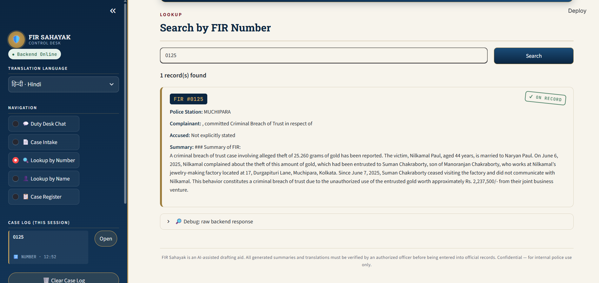

---

### 3. Search FIR by Name
> Find cases by complainant or accused name.

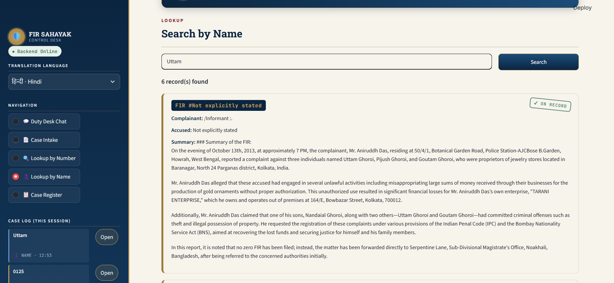

---

### 4. Load All FIRs
> View the complete case register.

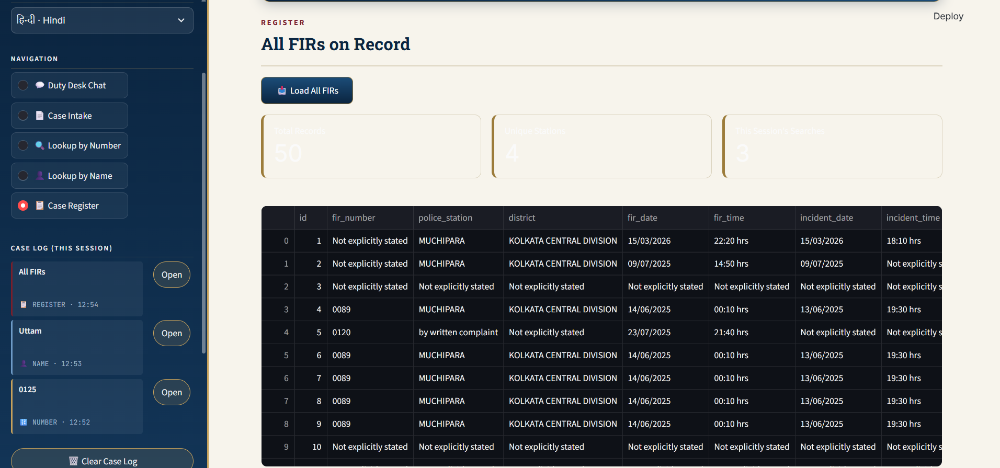  
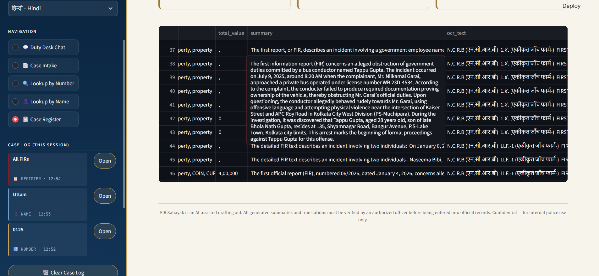

---

### 5. Conversational Chat Assistant (NLP Search)
> Interact with the AI assistant using natural language queries – it understands dates, names, and case numbers.

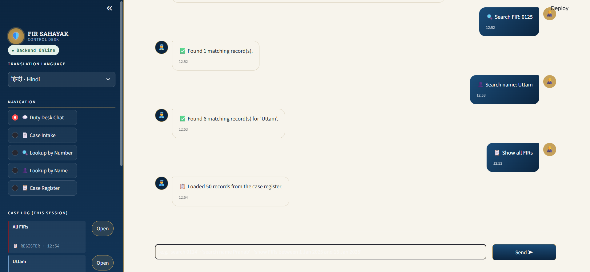  
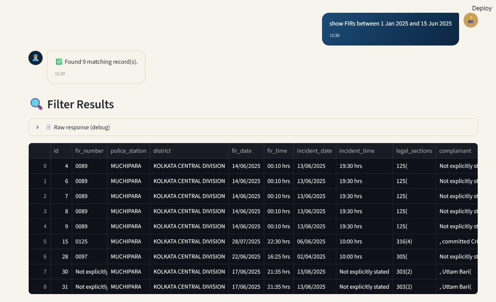  
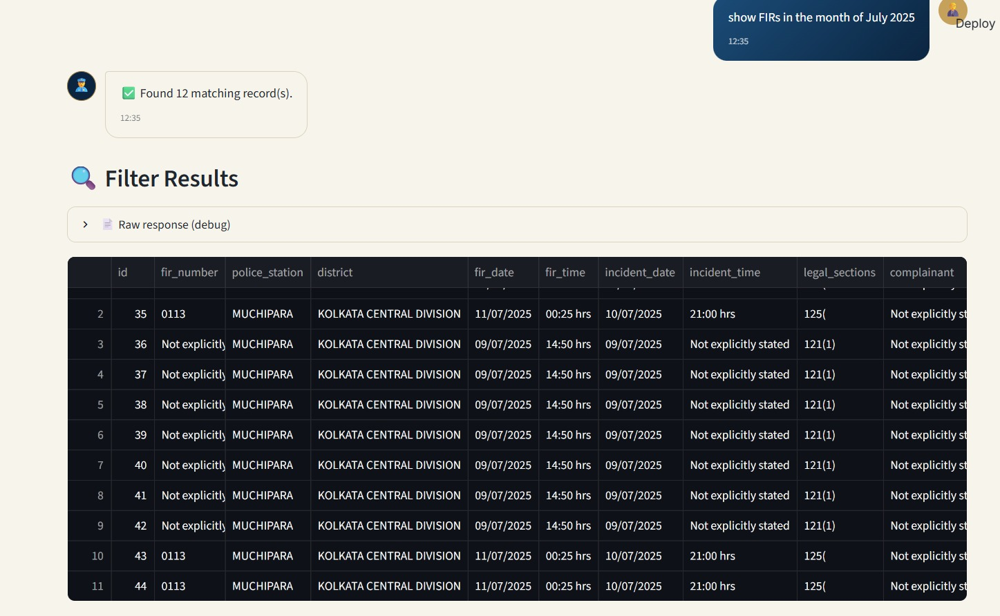  
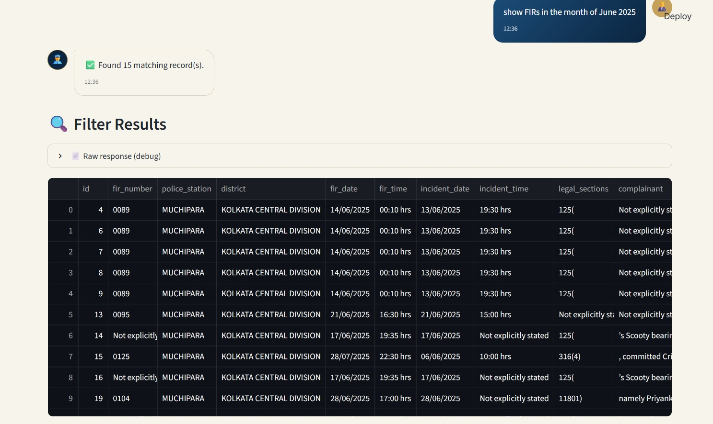  
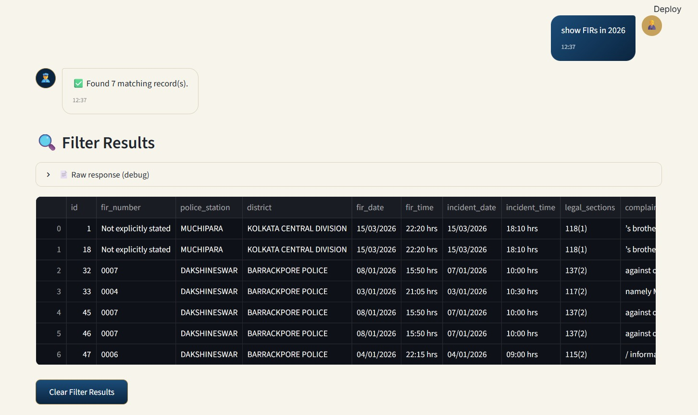

---

## 🧠 Model Details

### Summarization – Qwen2.5-1.5B-Instruct
- **Architecture**: Transformer decoder‑only model with 1.5 billion parameters.
- **Training**: Fine‑tuned on a curated dataset of Indian FIRs to produce structured, police‑ready summaries.
- **Inference**: Runs locally on CPU or GPU (with `torch.float16` for memory efficiency).
- **Prompting**: Uses a custom system prompt that instructs the model to extract all key facts: complainant details, incident date/time, location, description, property, and accused information.
- **Fallback**: If the summary is too short, the system falls back to the raw narrative to ensure completeness.

### Translation
- **Primary**: `googletrans` (Google Translate API) – used for high‑quality translations.
- **Secondary**: `deep_translator` as a fallback when the primary fails.
- **Offline mode**: The system can be configured to use local translation models (e.g., IndicTrans) for complete offline operation.

### OCR
- **Tesseract OCR** with language packs for **English, Hindi, and Bengali** to handle multilingual FIRs.

---

## ⚙️ Installation & Setup

### Prerequisites
- Python 3.9+
- Tesseract OCR ([download](https://github.com/UB-Mannheim/tesseract/wiki))
- Poppler ([download](https://github.com/oschwartz10612/poppler-windows/releases/))

### 1. Clone the Repository
```bash
git clone https://github.com/Saptakcodes/Multi-Lingual-FIR-Summarization-System-With-Case-Database-Using-Streamlit-UI.git
cd Multi-Lingual-FIR-Summarization-System-With-Case-Database-Using-Streamlit-UI
